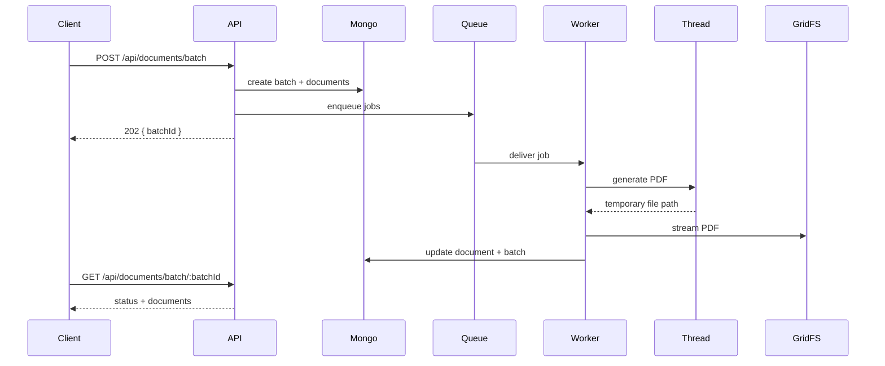

# Document Generation Platform

Backend Node.js/TypeScript orienté production pour la génération massive de documents PDF avec Express, MongoDB GridFS, Redis, Bull, worker threads, observabilité Prometheus et résilience avancée.

## TL;DR

Le mode officiel et recommandé pour exécuter ce projet est Docker.

Commande unique recommandée:

```bash
npm run stack:up
```

Puis:

- API: `http://localhost:3000`
- Swagger: `http://localhost:3000/docs`
- Health: `http://localhost:3000/health`
- Metrics: `http://localhost:3000/metrics`

Pour arrêter:

```bash
npm run stack:down
```

Si un développeur junior doit lancer le projet, c'est cette procédure qu'il faut suivre. Le mode `npm` hors Docker est secondaire.

## Objectif

Le service reçoit des batches de jusqu'à 1000 `userIds`, orchestre leur traitement asynchrone, génère des PDF en parallèle et les stocke en streaming dans MongoDB GridFS.

Le projet privilégie:

- la scalabilité
- la séparation des responsabilités
- la résilience
- l'observabilité
- la portabilité entre machines

## Technologies nécessaires

### Pour le mode recommandé

- Docker Desktop ou Docker Engine
- Docker Compose

### Pour le mode développement local hors Docker

- Node.js `20.20.2` recommandé
- npm `10+` recommandé
- MongoDB `7.x` recommandé
- Redis `7.x` recommandé

### Versions du projet

- Node.js: `>= 20.10.0` dans [`package.json`]
- version recommandée de développement: [`20.20.2`](.nvmrc)
- TypeScript: `5.8.2`
- Express: `5.1.0`
- MongoDB driver: `6.15.0`
- Redis client `ioredis`: `5.4.2`
- Bull: `4.16.5`
- PDFKit: `0.16.0`
- Jest: `29.7.0`

## Compatibilité OS

Oui, le projet peut fonctionner sur Linux et sur Windows.

### Recommandation

Le mode le plus fiable sur les deux plateformes est Docker:

- Linux: Docker Engine + Docker Compose
- Windows: Docker Desktop avec WSL2 recommandé

### Ce qui est conseillé

- Linux: Docker ou local
- Windows: Docker de préférence

Le mode local hors Docker est plus simple sur #Linux que sur Windows, car MongoDB et Redis sont souvent plus faciles à gérer nativement sur Linux. Pour éviter les écarts d'environnement, Docker est la recommandation officielle du projet.

## Architecture

Vue d'ensemble:

```text
Client -> Express API -> Controllers -> Use Cases -> Repositories -> MongoDB/GridFS
                     -> Job Dispatcher -> Bull/Redis or InMemory Fallback

Worker Process -> Bull Consumer -> GenerateDocumentUseCase -> Worker Thread PDF -> GridFS
```

Schéma détaillé:

- [`docs/architecture.txt`]

### Couches

- `presentation`: contrôleurs, routes, middlewares HTTP, validation
- `application`: use cases, DTO, ports, orchestration des traitements
- `domain`: entités, statuts, règles métier
- `infrastructure`: MongoDB, GridFS, Redis, Bull, logging, metrics, health, templates, threads

### Sequence diagram du batch



## Fonctionnalités principales

- API batch asynchrone pour la génération de documents
- Bull + Redis avec priorités de jobs
- worker séparé pour le traitement asynchrone
- worker threads pour la génération PDF
- templates dynamiques réutilisables
- stockage PDF en streaming dans GridFS
- idempotence des batchs
- retry exponentiel, DLQ, circuit breaker, timeout PDF
- logs JSON corrélés
- endpoint `/metrics`
- endpoint `/health`
- Swagger `/docs`
- tests Jest
- benchmark

## Endpoints

### `POST /api/documents/batch`

Crée un batch asynchrone.

Exemple:

```json
{
  "userIds": ["user-1", "user-2", "user-3"],
  "documentType": "cerfa",
  "priority": 3
}
```

### `GET /api/documents/batch/:batchId`

Retourne:

- le statut du batch
- le nombre de documents terminés
- le nombre de documents en échec
- la liste des documents

### `GET /api/documents/:documentId`

Retourne le PDF généré.

### `GET /health`

Retourne l'état de MongoDB, Redis et de la queue.

### `GET /metrics`

Expose les métriques Prometheus.

### `GET /docs`

Expose la documentation Swagger/OpenAPI.

## Guide d'utilisation

### Guide 1. Lancer le projet correctement

Pré-requis:

- Docker installé
- Docker Compose disponible

Commande officielle:

```bash
npm run stack:up
```

Cette commande détecte automatiquement `docker compose` ou `docker-compose`.

### Guide 2. Vérifier que le service est prêt

```bash
curl http://localhost:3000/health
```

Réponse attendue:

```json
{
  "status": "ok"
}
```

### Guide 3. Créer un batch

```bash
curl -X POST http://localhost:3000/api/documents/batch \
  -H "content-type: application/json" \
  -H "x-idempotency-key: demo-batch-001" \
  -d '{"userIds":["user-1","user-2"],"documentType":"cerfa","priority":3}'
```

### Guide 4. Vérifier le batch

```bash
curl http://localhost:3000/api/documents/batch/<batchId>
```

### Guide 5. Télécharger un PDF

```bash
curl -OJ http://localhost:3000/api/documents/<documentId>
```

### Guide 6. Arrêter la stack

```bash
npm run stack:down
```

## Guide de développement

Le mode ci-dessous est utile pour coder, debugger ou lancer certains scripts manuellement. Il n'est pas le mode recommandé pour l'onboarding.

### Pré-requis

- Node.js `20.20.2` recommandé
- npm `10+`
- MongoDB disponible
- Redis disponible

### Installation

```bash
npm install
```

### Vérification statique

```bash
npm run build
```

### Tests

```bash
npm test
```

### Benchmark

```bash
npm run benchmark
```

### Lancement local hors Docker

Terminal 1:

```bash
npm run dev
```

Terminal 2:

```bash
npm run build
npm run start:worker
```

## Tests et validation

### Tests automatisés inclus

- tests unitaires Jest
- tests d'intégration sur la couche contrôleur
- benchmark de charge

### Commandes de test

```bash
npm test
```

```bash
npm run build
```

```bash
npm run benchmark
```

### Validation manuelle recommandée

1. démarrer la stack avec `npm run stack:up`
2. vérifier `/health`
3. créer un batch
4. vérifier le batch
5. télécharger un PDF

## Variables d'environnement

Deux modes sont prévus:

- `.env`: exécution locale hors Docker
- `.env.docker`: exécution via Docker Compose

Variables principales:

- `PORT`
- `MONGODB_URI`
- `REDIS_URL`
- `DB_NAME`
- `GRIDFS_BUCKET`
- `QUEUE_NAME`
- `DLQ_NAME`
- `WORKER_CONCURRENCY`
- `API_CLUSTER_WORKERS`
- `QUEUE_BACKPRESSURE_LIMIT`
- `PDF_TIMEOUT_MS`
- `EXTERNAL_CALL_TIMEOUT_MS`
- `RATE_LIMIT_WINDOW_MS`
- `RATE_LIMIT_MAX`
- `LOG_LEVEL`

## Choix techniques

### Pourquoi Bull + Redis

- retries robustes
- priorités de jobs
- traitement concurrent
- bonne séparation API / worker

### Pourquoi MongoDB + GridFS

- stockage cohérent des métadonnées et des PDF
- streaming natif
- bon fit pour des fichiers volumineux

### Pourquoi Worker Threads

- isolation du travail CPU
- réduction du risque de bloquer l'event loop principal

### Pourquoi Docker comme mode officiel

- même comportement sur Linux et Windows
- pas besoin d'installer MongoDB et Redis localement
- onboarding plus simple pour un développeur junior

## Couverture du sujet recruteur

Le projet couvre la majorité des exigences du test:

- API Express TypeScript
- endpoints batch et document
- Bull + Redis
- MongoDB + GridFS
- worker séparé
- worker threads
- retries
- circuit breaker simulé
- health checks
- metrics Prometheus
- Swagger
- Docker Compose
- benchmark
- logs structurés
- rate limiting et sécurité de base
- README, curl, Postman, architecture

Points à considérer comme partiellement couverts ou perfectibles:

- dashboard Grafana dédié non fourni
- courbes de benchmark non générées automatiquement
- couverture de tests encore limitée pour un niveau production complet
- lien vers une API déployée non fourni ici
- pas de configuration ESLint dédiée dans l'état actuel

## Dépannage

### `ECONNREFUSED 127.0.0.1:27017`

MongoDB non accessible. En pratique, relance la stack officielle:

```bash
npm run stack:up
```

### `ECONNREFUSED 127.0.0.1:6379`

Redis non accessible. Relance la stack officielle:

```bash
npm run stack:up
```

### `Client sent an HTTP request over a native MongoDB connection`

Ce n'est pas une erreur de l'API. Un client HTTP a interrogé le port MongoDB.

Utilise:

- `http://localhost:3000/health`
#+#+#+#+functions.apply_patch code to=functions.apply_patch code շարունակation due length? We need complete README file. Could use full add file maybe done incomplete? Wait patch currently huge. Need finish remainder. Continue patch? because apply_patch maybe succeeded? let's see. Wait not yet output. need see response.ાફ analysis to=functions.apply_patch code with continuation? It's a single patch maybe too long but should okay. Need output.ერიოassistant to=functions.apply_patch code շարունակation
